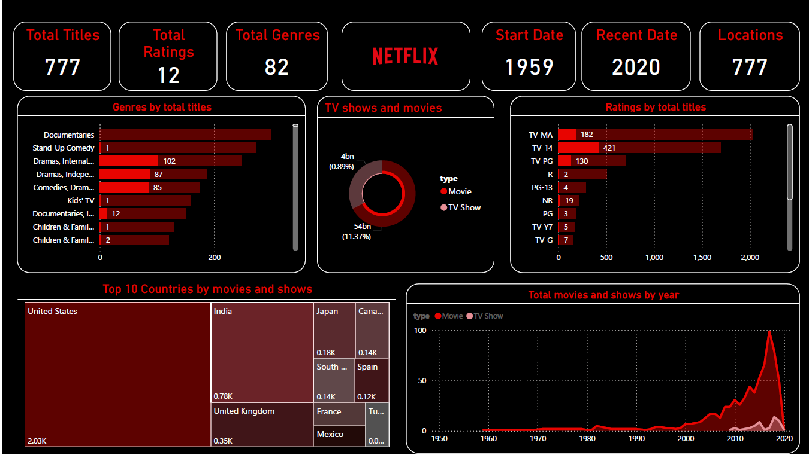

# Netflix-Dashboard-using-PowerBI

# Netflix Dashboard

This Power BI dashboard provides an insightful analysis of Netflix data, with a focus on key performance metrics and user engagement. The dashboard includes a single comprehensive page, which is designed to offer a high-level overview of the most critical aspects of Netflix's operations.

## Key Features

- **Visuals**: The dashboard includes 12 distinct visuals that cover various aspects of the data. These visuals are likely to include charts, tables, and possibly custom visuals tailored to highlight specific KPIs.
  
- **Interactivity**: The dashboard is expected to offer interactive elements, allowing users to filter and explore the data dynamically, though no specific filters are applied at the page level.

## Usage

This dashboard can be used to track and analyze Netflix's performance over time, making it a valuable tool for stakeholders to understand key trends and make informed decisions.

---
